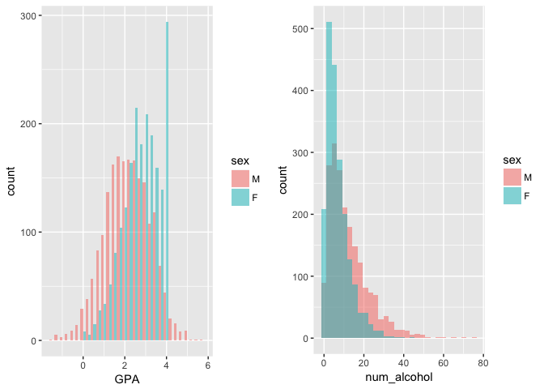
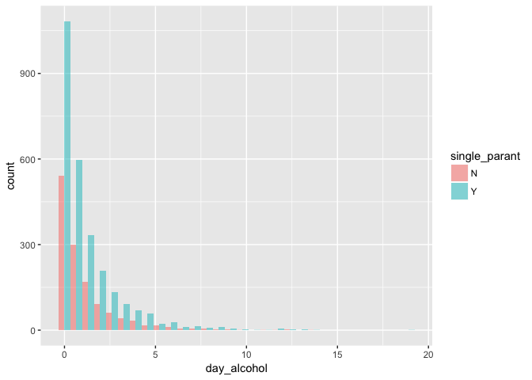
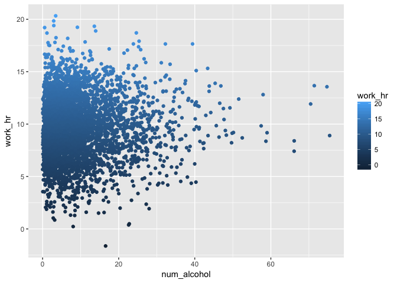
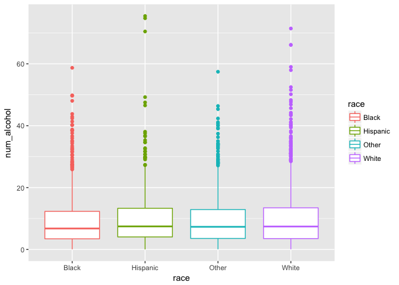
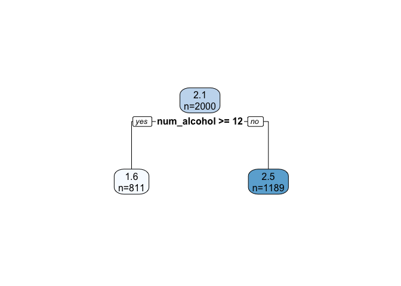
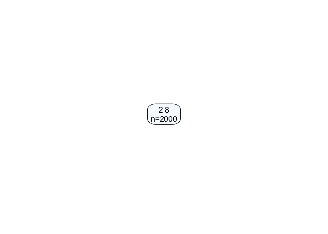

Reference article
=================

Balsa, A. I., Giuliano, L. M., & French, M. T. (2011). The effects of alcohol use on academic achievement in high school. Economics of Education Review, 30(1), 1–15. <http://www.ncbi.nlm.nih.gov/pmc/articles/PMC3026599/>

Introduction
============

In the United States, one in four individuals between the ages of 12 and 20 drinks alcohol on a monthly basis, and a similar proportion of 12th graders consumes five or more drinks in a row at least once every two weeks. Several studies have reported that alcohol use during adolescence affects educational attainment by decreasing the number of years of schooling and the likelihood of completing school. In this simulation project, I estimate the effects of drinking in high school on the quality of learning as captured by high school GPA. In addition, also consider other factors such as household characteristics.

Data Simulation
===============

The data set is simulated based on the descriptive statistics from the reference article. The literature shows that males and females behave differently both in terms of alcohol use and school achievement. Hence, the data will be simulated separately for male and female.

#### Outcome: Yearly GPA (`GPA`)

    Mean (male): 2.52, Mean (female): 2.79, Min: 0, Max: 4.00, 
    Normal distribution.
    If GPA < 0, then GPA = 0; if GPA > 4, then GPA = 4.
    For male, if average number of drinks consumed per month > 12.0, then GPA 
    generated from normal distribution with mean=1.52, sd=1.

#### Feature1: Sex (`sex`)

    Male (M): 0.5 (2000)
    Female (F): 0.5 (2000)

#### Feature2: Average number of drinks consumed per month (`num_alcohol`)

    mean (male): 12.0, 
    mean (female): 7.05; 
    Gamma distribution: shape=1.5, scale (male)=8, scale (female)=4.7

#### Feature3: Average number of days per month alcohol is consumed (`day_alcohol`)

    mean (male): 1.51, mean(female): 1.035; 
    Gamma distribution: shape=0.5, scale (male)=3, scale (female)=2.07

#### Feature4: English spoken in home (`english_spoken`)

    English spoken ("Y"): 0.7922; other languages ("N"): 0.2078

#### Feature5: Number of children in household (`num_kids`)

    Mean:1.15, Min: 1
    Normal distribution: mean=1.15, sd=0.5
    Take ceiling to get all the values equal to or larger than 1.

#### Feature6: Age (`age`)

    Mean:16 
    Uniform distribution: min:15, max:18

#### Feature7: Race (`race`)

    White: 0.47, Black: 0.19, Hispanic: 0.16, Other race: 0.18

#### Feature8: Smoke (`smoke`)

    smoke ("Y"): 15.8%, non-smoke ("N"): 84.2%.

#### Feature9: Single-parant family (`single_parant`)

    yes ("Y"): 0.66, no ("N"): 0.34

#### Feature10: Employed (`employed`)

    yes ("Y"): 0.615, no ("N"): 0.385

#### Feature11: Hours worked (`work_hr`)

    Mean (male): 9.63, mean (female): 8.115
    Normal distribution: sd=3

Code:
-----

``` r
generateMAlE <- function(N){
    sex <- rep("M", N)
    num_alcohol <- rgamma(N, shape = 1.5, scale = 8)
    num_alcohol <- ifelse(num_alcohol < 0, 0, num_alcohol)
    day_alcohol <- rgamma(N, shape = 0.5, scale = 3)
    day_alcohol <- ifelse(day_alcohol < 0, 0, day_alcohol)
    english_spoken <- sample(c("Y", "N"), N, replace=TRUE, prob=c(.7922, .2078))
    num_kids <- ceiling(rnorm(N, mean = 0.7, sd = 0.3)) 
    # the mean after ceiling will close to 1
    num_kids <- ifelse(num_kids < 0, 1, num_kids)
    age <- runif(N, min = 15, max = 18)
    race <- sample(c("White", "Black", "Hispanic", "Other"), N, replace=TRUE, 
                   prob=c(.47, .19, .16, .18))
    smoke <- sample(c("Y", "N"), N, replace=TRUE, prob=c(.158, .842))
    single_parant <- sample(c("Y", "N"), N, replace=TRUE, prob=c(.66, .34))
    employed <- sample(c("Y", "N"), N, replace=TRUE, prob=c(.615, .385))
    work_hr <- rnorm(N, mean = 9.63, sd = 3)
    GPA <- rnorm(N, mean = 2.52, sd =1)
    GPA <- ifelse(GPA < 0, 0, GPA)
    GPA <- ifelse(GPA > 4, 4, GPA)
    GPAlow <- rnorm(N, mean = 1.52, sd = 1)
    GPAlow <- ifelse(GPAlow < 0, 0, GPAlow)
    GPAlow <- ifelse(GPAlow > 4, 4, GPAlow)
    
    df <- data.frame(sex, num_alcohol, day_alcohol, english_spoken, num_kids, age, race,
                     smoke, single_parant, employed, work_hr, GPA)
    df$work_hr <- ifelse(df$employed == 0, 0, df$work_hr)
    df$GPA <- ifelse(df$num_alcohol > 12.0, GPAlow, df$GPA)
    return(df)
}

data.male <- generateMAlE(2000)
```

``` r
generateFEMAlE <- function(N){
    sex <- rep("F", N)
    num_alcohol <- rgamma(N, shape = 1.5, scale = 4.7)
    num_alcohol <- ifelse(num_alcohol < 0, 0, num_alcohol)
    day_alcohol <- rgamma(N, shape = 0.5, scale = 2.07)
    day_alcohol <- ifelse(day_alcohol < 0, 0, day_alcohol)
    english_spoken <- sample(c("Y", "N"), N, replace=TRUE, prob=c(.7922, .2078))
    num_kids <- ceiling(rnorm(N, mean = 0.7, sd = 0.3)) 
    # the mean after ceiling will close to 1
    num_kids <- ifelse(num_kids < 0, 1, num_kids)
    age <- runif(N, min = 15, max = 18)
    race <- sample(c("White", "Black", "Hispanic", "Other"), N, replace=TRUE, 
                   prob=c(.47, .19, .16, .18))
    smoke <- sample(c("Y", "N"), N, replace=TRUE, prob=c(.158, .842))
    single_parant <- sample(c("Y", "N"), N, replace=TRUE, prob=c(.66, .34))
    employed <- sample(c("Y", "N"), N, replace=TRUE, prob=c(.615, .385))
    work_hr <- rnorm(N, mean = 9.63, sd = 3)
    GPA <- rnorm(N, mean = 2.79, sd =1)
    GPA <- ifelse(GPA < 0, 0, GPA)
    GPA <- ifelse(GPA > 4, 4, GPA)

    
    df <- data.frame(sex, num_alcohol, day_alcohol, english_spoken, num_kids, age, race, 
                     smoke, single_parant, employed, work_hr, GPA)
    df$work_hr <- ifelse(df$employed == 0, 0, df$work_hr)

    return(df)
}

data.female <- generateFEMAlE(2000)
```

Data Exploration
================

Plots
-----

-   The histogram of GPA by gender shows that the GPA of female is higher than the GPA of male.
-   The histogram of "average number of drinks consumed per month" by gender shows that male consumed more drinks than female.



-   The histogram of "average number of days per month alcohol is consumed" shows that students in singel-parant families did not consume more alcohol than students in normal families.



-   The scatter plot of "average number of drinks consumed per month" and "hour employed" does not show any trend.



-   The boxplot of "average number of drinks consumed per month" by race does not show a difference among different races.



Correlations
------------

correlation coefficient between numerical variables:

-   Male

<!-- -->

    ##                      GPA  num_alcohol  day_alcohol     num_kids
    ## GPA          1.000000000 -0.317032770  0.018460524 -0.004794627
    ## num_alcohol -0.317032770  1.000000000 -0.009760214 -0.009030953
    ## day_alcohol  0.018460524 -0.009760214  1.000000000 -0.002305789
    ## num_kids    -0.004794627 -0.009030953 -0.002305789  1.000000000
    ## age         -0.018972225 -0.007414887 -0.012429523  0.028644733
    ## work_hr      0.018560935  0.012550688  0.017380927 -0.005416602
    ##                      age      work_hr
    ## GPA         -0.018972225  0.018560935
    ## num_alcohol -0.007414887  0.012550688
    ## day_alcohol -0.012429523  0.017380927
    ## num_kids     0.028644733 -0.005416602
    ## age          1.000000000  0.002615931
    ## work_hr      0.002615931  1.000000000

The correlation coefficients show that only the "average number of drinks consimed per month" has a negative linear correlation with GPA, other variables do not have any significant correlations between each other.

-   Female

<!-- -->

    ##                      GPA  num_alcohol   day_alcohol     num_kids
    ## GPA          1.000000000  0.049709265 -0.0015939154 -0.003048846
    ## num_alcohol  0.049709265  1.000000000  0.0021601172  0.048770288
    ## day_alcohol -0.001593915  0.002160117  1.0000000000  0.001141772
    ## num_kids    -0.003048846  0.048770288  0.0011417722  1.000000000
    ## age          0.012923956 -0.001861725  0.0007269579  0.029345623
    ## work_hr     -0.017876793  0.023525419 -0.0334430093  0.013589514
    ##                       age     work_hr
    ## GPA          0.0129239560 -0.01787679
    ## num_alcohol -0.0018617253  0.02352542
    ## day_alcohol  0.0007269579 -0.03344301
    ## num_kids     0.0293456227  0.01358951
    ## age          1.0000000000  0.01061437
    ## work_hr      0.0106143711  1.00000000

The correlation coefficients show that there is no any significant correlations between any two variables.

### One-Way ANOVA

Use One-Way ANOVA to show the effects of categorical variables to GPA.

-   English-spoken (male)

<!-- -->

    ##                  Df Sum Sq Mean Sq F value Pr(>F)
    ## english_spoken    1    0.2  0.2498    0.21  0.647
    ## Residuals      1998 2380.6  1.1915

-   English-spoken (female)

<!-- -->

    ##                  Df Sum Sq Mean Sq F value Pr(>F)
    ## english_spoken    1    0.1  0.0681   0.086   0.77
    ## Residuals      1998 1585.9  0.7937

English-spoken does not show a significant difference in GPA, both for male and female.

-   Race (male)

<!-- -->

    ##               Df Sum Sq Mean Sq F value Pr(>F)
    ## race           3    6.2   2.079   1.747  0.155
    ## Residuals   1996 2374.7   1.190

-   Race (female)

<!-- -->

    ##               Df Sum Sq Mean Sq F value Pr(>F)
    ## race           3    0.9  0.3136   0.395  0.757
    ## Residuals   1996 1585.0  0.7941

There is no significant difference on GPA among different races.

-   Smoke (male)

<!-- -->

    ##               Df Sum Sq Mean Sq F value Pr(>F)
    ## smoke          1    0.3  0.2794   0.234  0.628
    ## Residuals   1998 2380.6  1.1915

-   Smoke (female)

<!-- -->

    ##               Df Sum Sq Mean Sq F value Pr(>F)
    ## smoke          1    0.3  0.2574   0.324  0.569
    ## Residuals   1998 1585.7  0.7936

There is no significant difference on GPA between smoke or not.

-   Single-parant (male)

<!-- -->

    ##                 Df Sum Sq Mean Sq F value Pr(>F)  
    ## single_parant    1    5.6   5.558   4.675 0.0307 *
    ## Residuals     1998 2375.3   1.189                 
    ## ---
    ## Signif. codes:  0 '***' 0.001 '**' 0.01 '*' 0.05 '.' 0.1 ' ' 1

    ##                     eta^2
    ## single_parant 0.002334277
    ## Residuals              NA

The GPA is significantly different on whether males are in single-parant families or not, but it can only explain 0.23 of the GPA.

-   Single-parant (female)

<!-- -->

    ##                 Df Sum Sq Mean Sq F value Pr(>F)
    ## single_parant    1    1.8  1.7875   2.254  0.133
    ## Residuals     1998 1584.2  0.7929

The GPA has no significant difference on whether females are in single-parant families or not.

-   Employed (male)

<!-- -->

    ##               Df Sum Sq Mean Sq F value Pr(>F)  
    ## employed       1    4.6   4.595   3.864 0.0495 *
    ## Residuals   1998 2376.3   1.189                 
    ## ---
    ## Signif. codes:  0 '***' 0.001 '**' 0.01 '*' 0.05 '.' 0.1 ' ' 1

    ##                 eta^2
    ## employed  0.001930128
    ## Residuals          NA

The GPA is significantly different on whether males are employed or not, but it can only explain 0.19 of the GPA.

-   Employed (female)

<!-- -->

    ##               Df Sum Sq Mean Sq F value Pr(>F)
    ## employed       1    0.2  0.2231   0.281  0.596
    ## Residuals   1998 1585.7  0.7937

The GPA has no significant difference on whether females are employed or not.

Data Analysis
=============

Regression Analysis
-------------------

-   Male

``` r
male.fit1 <- lm(GPA ~ num_alcohol + day_alcohol + english_spoken + num_kids +
                    age + race + smoke + single_parant + employed + work_hr, 
                data = data.male)
summary(male.fit1)
feature.selection.male <- step(male.fit1)
```

Regression model after feature selection using "step" function: For males, "average number of drinks consumed per month", "single-parant family", and "employed" significantly affect their GPA. However, the model can only explain 10.39% of the variation.

``` r
summary(feature.selection.male)
```

    ## 
    ## Call:
    ## lm(formula = GPA ~ num_alcohol + single_parant + employed, data = data.male)
    ## 
    ## Residuals:
    ##     Min      1Q  Median      3Q     Max 
    ## -4.0274 -0.7370  0.0176  0.7255  3.6161 
    ## 
    ## Coefficients:
    ##                 Estimate Std. Error t value Pr(>|t|)    
    ## (Intercept)     2.413470   0.058270   41.42   <2e-16 ***
    ## num_alcohol    -0.033899   0.002259  -15.01   <2e-16 ***
    ## single_parantY  0.124782   0.049512    2.52   0.0118 *  
    ## employedY       0.100949   0.048060    2.10   0.0358 *  
    ## ---
    ## Signif. codes:  0 '***' 0.001 '**' 0.01 '*' 0.05 '.' 0.1 ' ' 1
    ## 
    ## Residual standard error: 1.033 on 1996 degrees of freedom
    ## Multiple R-squared:  0.1053, Adjusted R-squared:  0.1039 
    ## F-statistic: 78.27 on 3 and 1996 DF,  p-value: < 2.2e-16

-   Female

``` r
female.fit1 <- lm(GPA ~ num_alcohol + day_alcohol + english_spoken + num_kids +
                    age + race + smoke + single_parant + employed + work_hr, 
                data = data.female)
summary(female.fit1)
feature.selection.female <- step(female.fit1)
```

Regression model after feature selection using "step" function: For females, "average number of drinks consumed per month" and "single-parant family" significantly affect their GPA. However, the model can only explain 0.2491% of the variation.

``` r
summary(feature.selection.female)
```

    ## 
    ## Call:
    ## lm(formula = GPA ~ num_alcohol + single_parant, data = data.female)
    ## 
    ## Residuals:
    ##      Min       1Q   Median       3Q      Max 
    ## -2.79699 -0.56711  0.07239  0.71165  1.31444 
    ## 
    ## Coefficients:
    ##                Estimate Std. Error t value Pr(>|t|)    
    ## (Intercept)    2.683087   0.041367  64.860   <2e-16 ***
    ## num_alcohol    0.007333   0.003371   2.175   0.0297 *  
    ## single_parantY 0.060308   0.042233   1.428   0.1535    
    ## ---
    ## Signif. codes:  0 '***' 0.001 '**' 0.01 '*' 0.05 '.' 0.1 ' ' 1
    ## 
    ## Residual standard error: 0.8896 on 1997 degrees of freedom
    ## Multiple R-squared:  0.003489,   Adjusted R-squared:  0.002491 
    ## F-statistic: 3.496 on 2 and 1997 DF,  p-value: 0.03052

Decision Trees
--------------

-   Male Only "average number of drinks consumed per month" is used to build the decision tree.

``` r
library(rpart)
library(rpart.plot)
set.seed(1)
frmla <- GPA ~ num_alcohol + day_alcohol + english_spoken + num_kids +
                    age + race + smoke + single_parant + employed + work_hr
male_tree <- rpart(frmla, data=data.male)
# text version of the resulting tree:
male_tree 
```

    ## n= 2000 
    ## 
    ## node), split, n, deviance, yval
    ##       * denotes terminal node
    ## 
    ## 1) root 2000 2380.8890 2.143133  
    ##   2) num_alcohol>=11.96125 811  840.5604 1.603497 *
    ##   3) num_alcohol< 11.96125 1189 1143.0730 2.511210 *

``` r
# extra=1: Display the number of observations that fall in the node
rpart.plot(male_tree, extra = 1)
```



-   Female Nothing can use to build a decision tree.

``` r
female_tree <- rpart(frmla, data=data.female)
# text version of the resulting tree:
female_tree 
```

    ## n= 2000 
    ## 
    ## node), split, n, deviance, yval
    ##       * denotes terminal node
    ## 
    ## 1) root 2000 1585.964 2.775145 *

``` r
# extra=1: Display the number of observations that fall in the node
rpart.plot(female_tree, extra = 1)
```



Random Forest
-------------

-   Male "Average number of drinks consumed per month" is the most important node for the random forest.

``` r
library(randomForest)
fit.rf.male <- randomForest(frmla, data=data.male)
importance(fit.rf.male)
```

    ##                IncNodePurity
    ## num_alcohol        736.15911
    ## day_alcohol        365.82698
    ## english_spoken      39.66095
    ## num_kids            45.94610
    ## age                344.30602
    ## race               107.16911
    ## smoke               34.07389
    ## single_parant       37.17069
    ## employed            38.62650
    ## work_hr            344.30913

-   Female "Average number of drinks consumed per month", "Average number of days per month alcohol is consumed", Aage", and "Hours worked" are the most important nodes for the random forest.

``` r
fit.rf.female <- randomForest(frmla, data=data.female)
importance(fit.rf.female)
```

    ##                IncNodePurity
    ## num_alcohol        284.04428
    ## day_alcohol        282.53991
    ## english_spoken      28.24357
    ## num_kids            31.67539
    ## age                282.01529
    ## race                84.47603
    ## smoke               25.29886
    ## single_parant       31.93507
    ## employed            31.99470
    ## work_hr            281.05865
